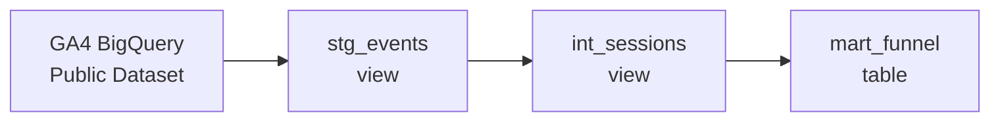

# Cart Abandonment Pipeline

An end-to-end analytics pipeline that models Google Analytics 4 (GA4) 
e-commerce event data into a session-level purchase funnel, identifying 
where users drop off across five funnel stages.

## Architecture



## Funnel Stages

| Stage | Event |
|-------|-------|
| 1 | page_view |
| 2 | view_item |
| 3 | add_to_cart |
| 4 | begin_checkout |
| 5 | purchase |

Each session is assigned the deepest funnel stage it reached.

## Project Structure

```
models/
├── staging/
│   └── stg_events.sql        # Filter and cast raw GA4 events
├── intermediate/
│   └── int_sessions.sql      # Session construction (30-min inactivity window)
└── mart/
    └── mart_funnel.sql       # Session-level funnel stage classification
```

## Tech Stack

- **Transformation** — dbt Core
- **Warehouse** — Google BigQuery
- **Source** — GA4 Obfuscated Sample E-commerce Dataset (BigQuery public data)

## Getting Started

### Prerequisites
- Python 3.8+
- dbt Core with BigQuery adapter
- Google Cloud account with BigQuery access

### Setup

```bash
# Install dbt
pip install dbt-bigquery

# Clone the repo
git clone https://github.com/DcBait/cart-abandonment-pipeline.git
cd cart-abandonment-pipeline/dbt_project/cart_abandonment

# Configure your BigQuery profile in ~/.dbt/profiles.yml
# (see profiles.yml.example if provided)

# Install dbt dependencies
dbt deps

# Run the pipeline
dbt run

# Run tests
dbt test
```

## Key Design Decisions

**Session construction** — sessions are defined using a 30-minute inactivity 
window, consistent with how Google Analytics itself defines sessions. A 
`LAG` window function detects gaps between consecutive events per user, 
and a cumulative `SUM` assigns a unique session ID.

**Funnel classification** — each session is assigned its deepest reached 
stage using `MAX(CASE WHEN)` aggregation, so a session that reached 
checkout is classified as `4_checkout` even if it also triggered 
earlier events. Stage labels are prefixed numerically for correct 
sort ordering in BI tools.

## What I'd Add With Real Streaming Data

- Kafka or Pub/Sub ingestion layer for live GA4 event streaming
- Airflow or Prefect DAG to orchestrate incremental dbt runs
- dbt snapshots to track funnel stage changes over time
- Alerting on sudden drops in purchase conversion rate
